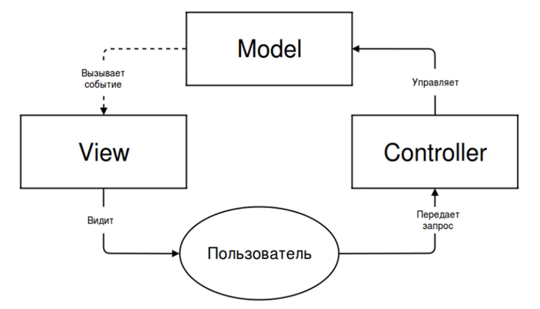
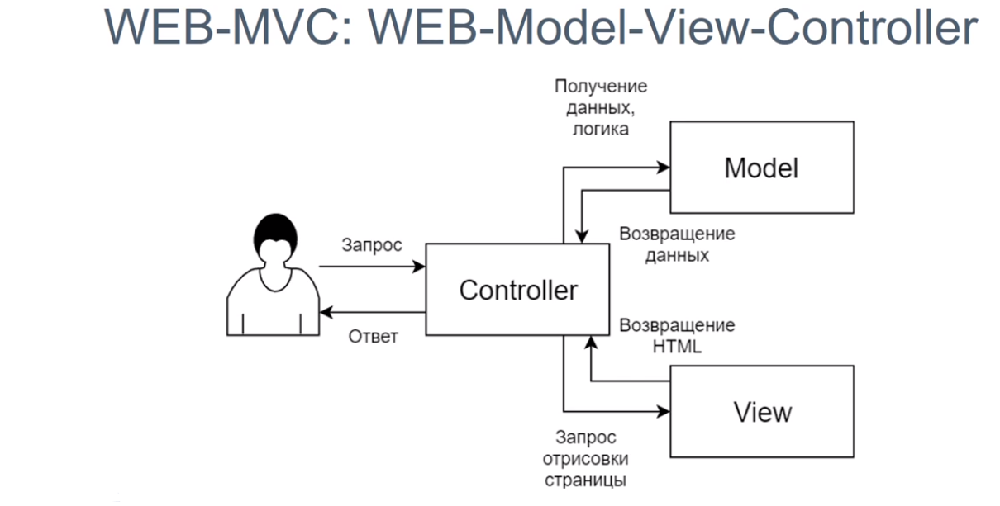
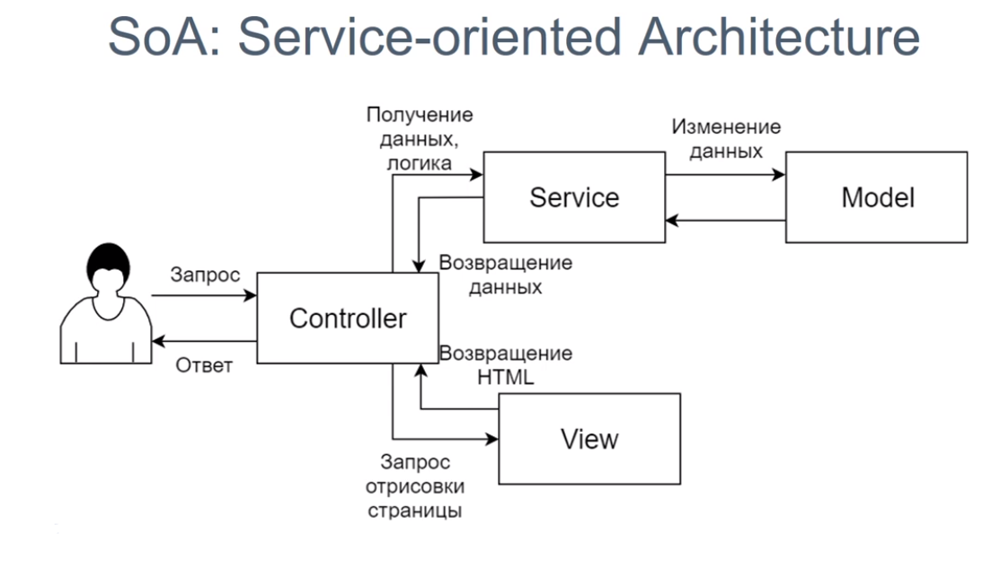
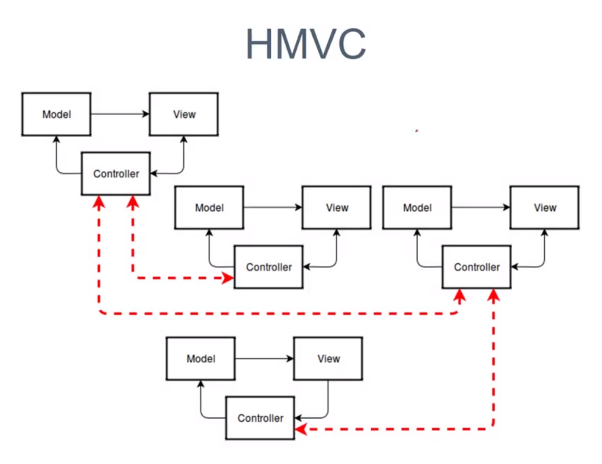
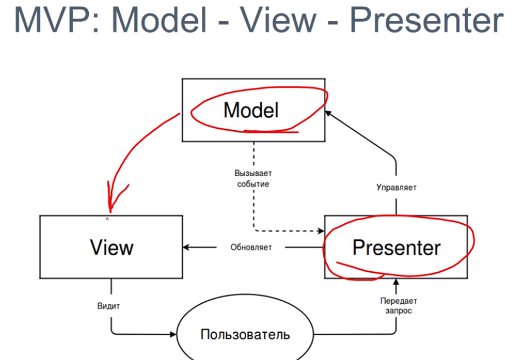
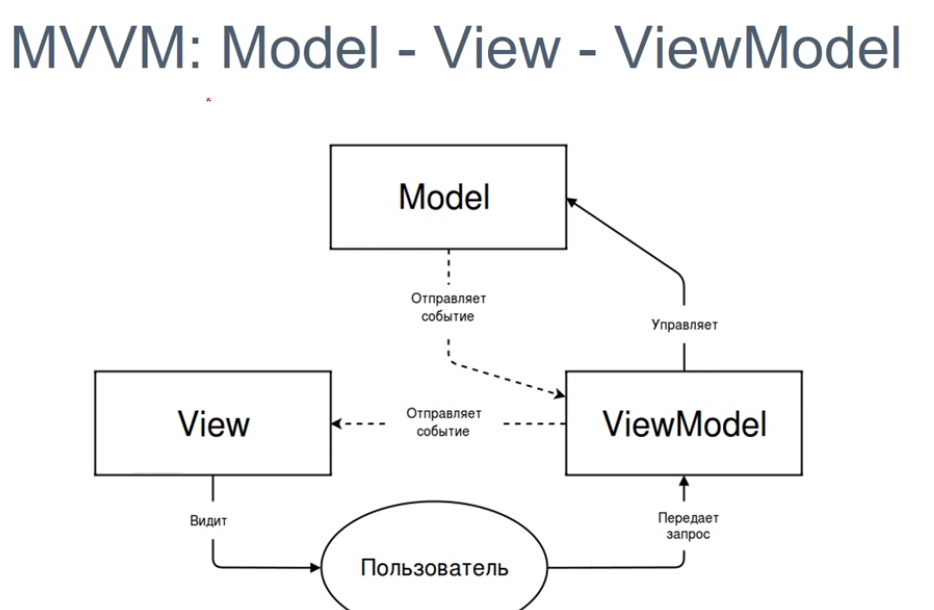
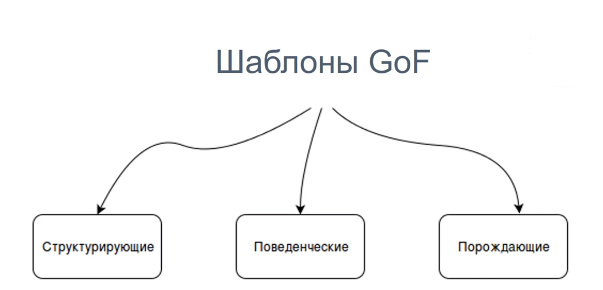

#Архитектура веб-приложений

**Что такое архитектура ПО?**
1. Результат декомпозиции
2. Некие конструктивные решения в организация приложения

**Критерии качественного ПО**
1. Эффективность
2. Гибкость
3. Расширяемость
4. Возможность переиспользования
5. Тестируемость
6. Сопровождаемость

**MVC: Model-View-Controller**

**WEB-MVC: WEB-Model-View-Controller**

_Стандартное реализации WEB-MVC -  Нет._
**Логику в:**
 - Passive MVC - Контроллер
 - Active MVC - Модель
 
 **SoA: Service-oriented Architecture**
 
 
**HMVC Hierarchical MVC**

  
**MVP Model - View - Presenter**

**SPA - singal page application**

**MVVM Model - View - ViewModel**

**1. Плоская структура - все в одной папке**
-
- UserController
- ProductController
- User
- Role
- Product
- UserService
...

**2. Плоская по уровням**
-
- Controller
    - UserController 
    - ProductController
- Entity
    - User
    - Role
    - Product
- Service
    - UserService
...

**3. Модульная**
-
- User
    - Controller
        - UserController 
    - Entity
        - User
        - Role
    - Service
        - UserService
- Product
    - Controller
        - ProductController
    - Entity 
        - Product
...

**4. Луковая, предлагаема DDD**
-
- User
    - Http
        - Controller
            - UserController 
        - Entity
            - User
        - Service
            - UserService
        - Domain
            - Entity
                - User
                - Role
- Product
    - Http
        - Controller
            - ProductController
        - Entity 
            - Product
...

**Gof Шаблоны**

### Принципы образования шаблонов
* **общепринятые для разработки ПО: DRY, KISS, YAGNI**
    * **DRY** - Don't repeat yourself - "программист должен быть ленивым" - какой либо блок кода не должен встречаться 2 раза
    * **KISS** - Keep it super simple - делай все как можно проще - Можно ли сделать еще проще?
    * **YAGNI** - You aren't gonna need it - Тебе это не понадобится, не делай заранее если это не обходимо
* **для ООП: SOLID**
    * **SOLID** :
       * S **Принцип единственной отвественности   ( The single Responsibility Principle )**   - Существует лишь одна причина приводящая к изменению класса
       * O **Принцип открытости / закрытости   ( The Open Closed Principle )**   - Программные сущности ( классы, модули, функции, и др.) должны быть открыты для расширения, но закрыты для изменения
       * L **Принцип постановики Барбары Лисков   ( The Liskov Substitution Principle )**   - Обьекты в программе могут быть заменены их наследниками без изменения свойств программы
       * I **Принцип разделения Интерфейса   ( The interface Segregation Principle )**   - Множество специализированных интерфейсов лучше, чем один универсальный
       * D **Принцип инверсии зависимостей   ( The Dependency Inversion Principle )**   - Зависимости должны строиться относительно абстракций, а не деталей
    * **Внедрение зависимости**
        * **через конструктов** - подходит для заисимостей без которых никак
        * **через метод-сеттер**- подходит больше для опциональных зависимостей
        * **через публичное свойство** - так делать не стоит особенно в PHP
* **обобщенные для ООАП: GRASP**